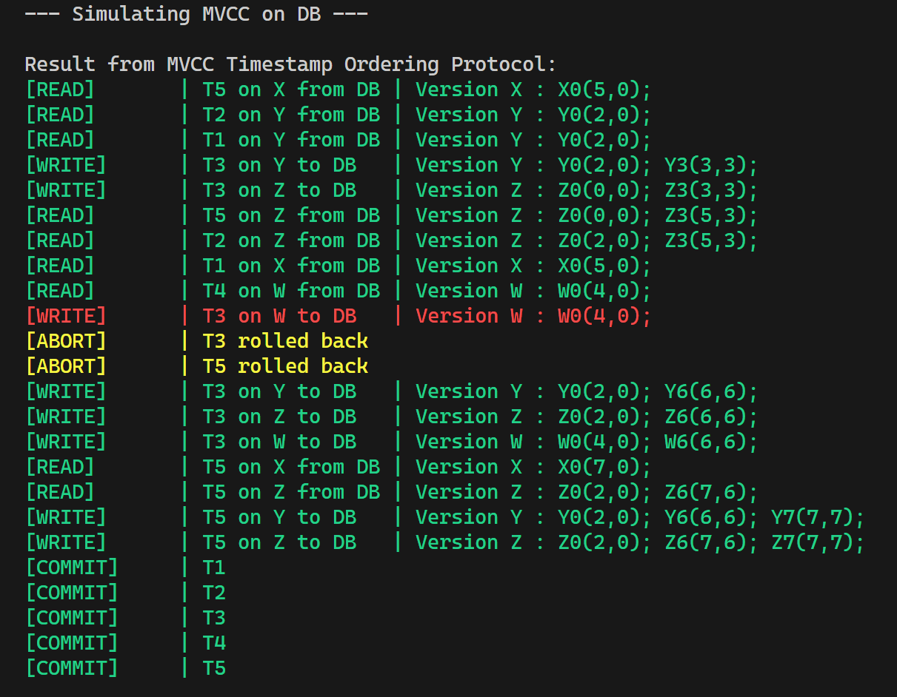

# Database Concurrency Control Protocol Simulation
> This source code is made by G02/K02 to fulfill Database Management Project Task on Concurrency Control simulation using Two Phase Locking (2PL), Optimistic Concurrency Control (OCC), and Multiversion Concurrency Control Protocol

## Table of Content
- [Author](#author)
- [General Information](#general-information)
- [Project Structure](#project-structure)
- [Requirements](#requirements)
- [How to Run the Program](#how-to-run-the-program)
- [Input Format](#input-format)
- [Screenshots](#screenshots)

## Author
| Name                     |   NIM    |
|--------------------------|:--------:|
| Muhammad Fahkry Malta    | 13519032 |
| Michael Leon Putra Widhi | 13521108 |
| Ulung Adi Putra          | 13521122 |
| Nathan Tenka             | 13521172 |

## General Information
In the realm of database management systems (DBMS), concurrency control is a critical aspect ensuring the consistency of data in multi-user environments. Employing various protocols, such as Two-Phase Locking (2PL), Optimistic Concurrency Control (OCC), and Multi-Version Concurrency Control (MVCC), plays a pivotal role in mitigating conflicts arising from concurrent transactions. Two-Phase Locking adheres to a systematic approach where transactions acquire and release locks in two distinct phases, preventing potential data inconsistencies. Optimistic Concurrency Control, on the other hand, allows transactions to proceed concurrently without acquiring locks initially, but validates changes before committing to ensure consistency. Multi-Version Concurrency Control maintains multiple versions of a data item to enable concurrent access, providing a snapshot of the database at the time a transaction begins. These protocols collectively contribute to efficient and reliable concurrency management, facilitating seamless interaction within DBMS environments.

## Project Structure
```bash
.
├─── doc
├─── image
├─── public
│   └─── index.html
├─── 2pl
│   ├─── test
│   │   ├─── test1.txt
│   │   ├─── test2.txt
│   │   ├─── test3.txt
│   │   └─── test4.txt
│   ├─── FileHandler.py
│   ├─── main.py
│   └─── twoPL.py
├─── mvcc
│   ├─── test
│   │   └─── test1.txt
│   ├─── FileHandler.py
│   ├─── Lib.py
│   ├─── main.py
│   └─── Mvcc.py
├─── occ
│   ├─── test
│   │   ├─── test1.txt
│   │   ├─── test2.txt
│   │   ├─── test3.txt
│   │   └─── test4.txt
│   ├─── FileHandler.py
│   ├─── Lib.py
│   ├─── main.py
│   └─── Occ.py
├─── .gitignore
└─── README.md
```

## Requirements
- Python (3.9+ would be nice)

## How to Run the Program
1. Do clone repository from terminal using this command
   ``` bash
    $ git clone https://github.com/mikeleo03/Database-Concurrency-Control.git
   ```
2. Change directory to any concurrency control you want to run (2pl, mvcc, occ), for example
   ``` bash
    $ cd mvcc
   ```
3. Prepare a .txt file containing the list of operations you want to simulate. use this [input format](#input-format) and store it on test folder
4. Run the program using this command 
   ``` bash
    $ python main.py test/<test_case _name>
   ```
   for example
   ``` bash
    $ python main.py test/test1.txt
   ```

## Input Format
DBMS operation is using following convention :
1. `Rx(A)` stands for read operation on item data A from transaction Tx
2. `Wx(A)` stands for write operation on item data A from transaction Tx
3. `Cx` stands for commit operation from transaction Tx

By using that convention, the input will be trailing of operations separated by enter and semicolons except the last operation, for example
```bash
R1(E);
R2(G);
R1(F);
R2(F);
R1(G);
R2(E);
W1(F);
W2(E);
W1(G);
C2;
C1
```

## Screenshots
